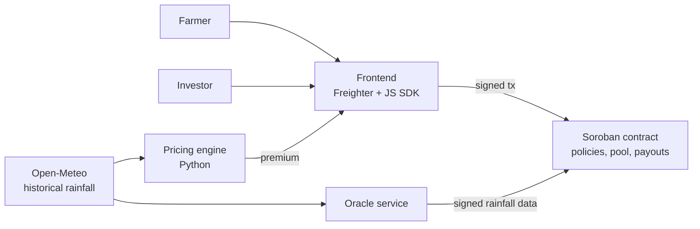

# Parametric Drought Insurance on Stellar

> Drought insurance that pays out automatically when the rainfall data says there was a drought. No claims, no loss adjusters.

**Status:** pre-hackathon planning for [HackMeridian 2026](https://www.hackmeridian.com/) (Genesis track, Lisbon, 25–26 October). The code will be built at the event.

## The problem

Small farmers are among the most exposed to climate risk and the least served by insurance. Traditional crop insurance relies on loss adjusters and claims, which makes it slow, costly to run and uneconomical for small policies. In most of the world, there is simply no crop insurance at all.

## The idea

Instead of measuring the damage, we measure what causes it: **how much it rained**.

- A farmer insures a plot and pays a premium in USDC.
- The rule is fixed upfront. If cumulative rainfall in the coverage window falls below a threshold, the policy pays out.
- When the window closes, an oracle publishes the rainfall for the plot's location, and a Soroban smart contract settles automatically.
- Investors fund a liquidity pool. They earn the premiums and cover the payouts.

**Pilot:** drought cover for rain-fed barley in Aragón, Spain, with an April–May rainfall window. We chose a narrow case we know well and have decades of data for. The model is designed for regions without access to insurance.

## Architecture

| Component | Stack | Role |
| --- | --- | --- |
| Smart contract | Rust, Soroban | Policies, liquidity pool, reserve locking, payout settlement |
| Oracle | Python / Node | Reads rainfall for the plot's coordinates and submits it, signed by an authorised account |
| Pricing engine | Python | Premium = historical trigger frequency × insured amount + margin |
| Frontend | TypeScript | Wallet connection, policy purchase, investor dashboard |
| AI layer | LLM | Turns a plain-language request into policy parameters and explains the premium |

**Design choices**

- **Deterministic pricing.** Premiums come from 30+ years of rainfall data, not from an LLM, so they are reproducible and auditable.
- **Solvency first.** Each policy locks its maximum payout, and no policy is issued that free capital cannot cover.
- **No adverse selection.** Sales close before the coverage window starts.

## Why Stellar

- Premiums and payouts are small, so near-zero fees are essential.
- USDC is native on Stellar, and anchors offer a path to local currency.
- Stellar's focus on financial inclusion matches the target users.

## Hackathon scope

- [ ] Soroban contract on testnet: create policy, deposit and withdraw liquidity, receive oracle data, settle payout
- [ ] Signed oracle service with real historical rainfall data
- [ ] Premium calculation from historical data
- [ ] Frontend with wallet connection
- [ ] Demo mode: replay a real dry year (payout) and a normal year (no payout)
- [ ] Stretch: tiered payouts, pool risk dashboard, natural-language policy creation, passkey onboarding

**Out of scope:** real fiat off-ramp, multiple regions or crops, KYC, plot verification.

## Known limitations

- **Oracle trust:** a single authorised signer. Next step: require agreement between multiple data sources.
- **Basis risk:** a farmer can suffer drought that the data does not reflect. We reduce it by using the grid cell of the plot rather than a distant weather station.
- **Regulation:** real insurance is regulated. This is a testnet prototype, not a product.

## Team

- **[Name]** · [GitHub](https://github.com/) · smart contracts
- **[Name]** · [GitHub](https://github.com/) · data, oracle and frontend

4th-year Computer Engineering students from Zaragoza, Spain.
